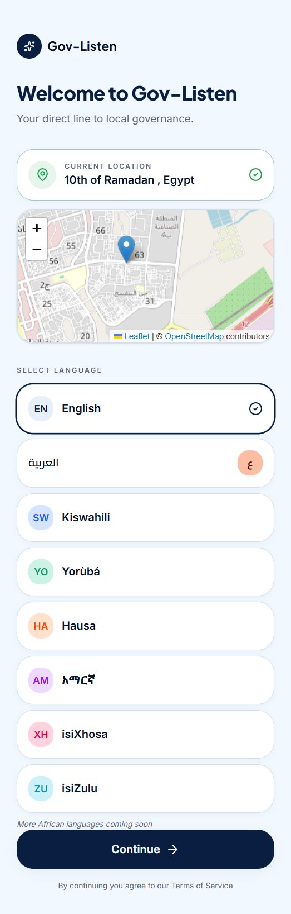
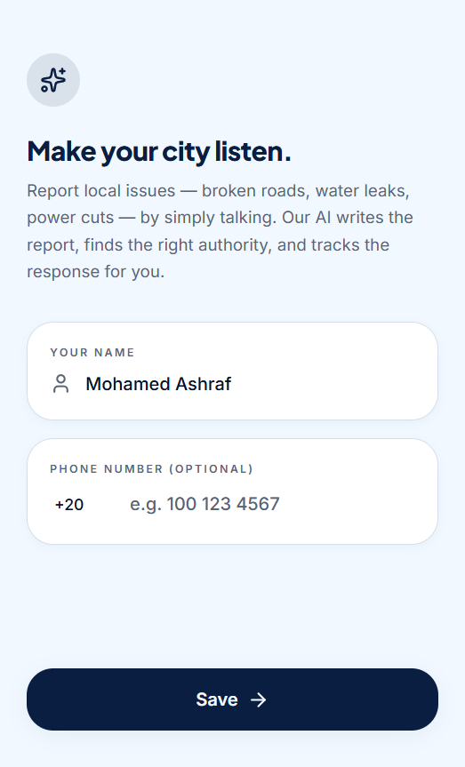
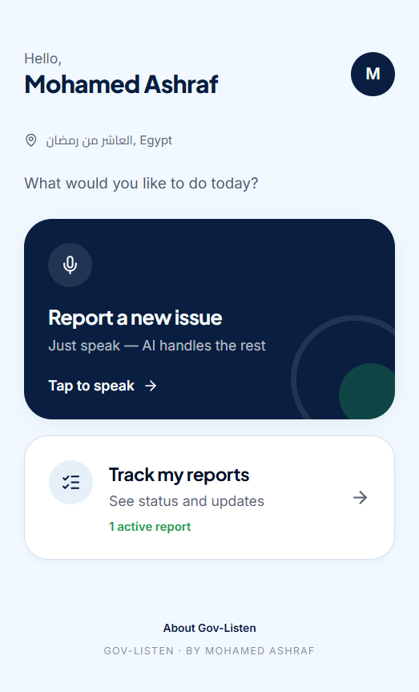
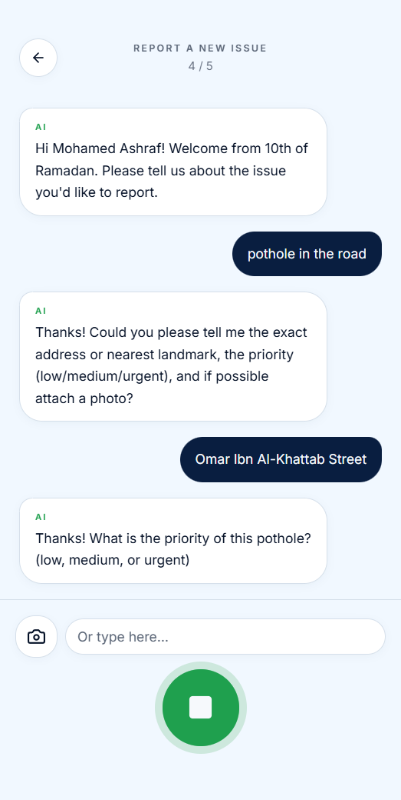
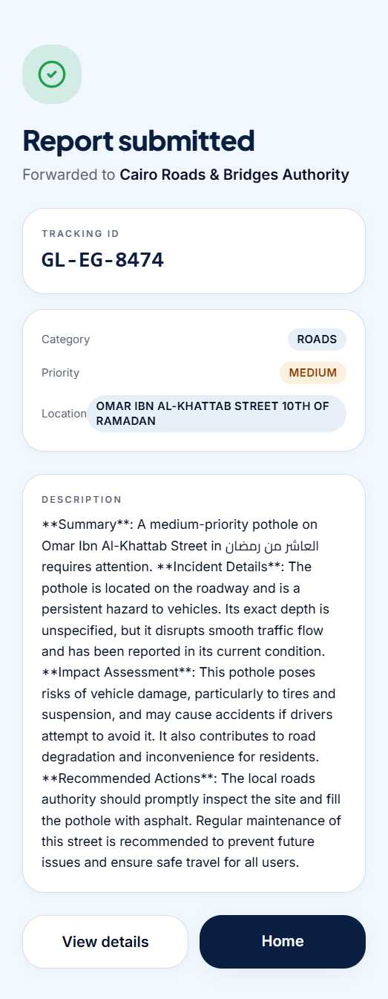
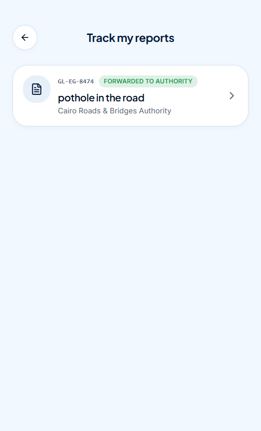

# Gov-Listen 🌍🗣️

🚀 **[Click Here to Experience the Live Demo](https://gov-listen.vercel.app)**

**Developed by:** Mohamed Ashraf Abdelwahab Mohamed  
**Submitted for:** The 3rd Edition of the Presidential African Youth in AI and Robotics Competition 2026  
**Category:** Community Impact and Good Governance Innovation  

---

## 📋 Table of Contents

- [About the Project](#-about-the-project)
- [The Problem](#-the-problem)
- [The Solution](#-the-solution)
- [How It Works](#-how-it-works)
- [Features](#-features)
- [Tech Stack](#-tech-stack)
- [Project Structure](#-project-structure)
- [Getting Started](#-getting-started)
- [Server Functions](#-server-functions)
- [Multi-Language Support](#-multi-language-support)
- [Government Authority Routing](#-government-authority-routing)
- [Screenshots](#-screenshots)
- [About the Developer](#-about-the-developer)

---

## 💡 About the Project

**Gov-Listen** is an AI-powered civic reporting platform built for African citizens. Instead of filling out complex forms or writing official letters, citizens simply **speak** in their own language — and the AI handles the rest: transcribes the speech, extracts key details, generates a professional report, and automatically routes it to the correct government authority.

The platform is designed from day one to serve **all 55 African Union states**, with a per-country government authority registry, multi-language support, and mobile-first architecture.

---

## ❗ The Problem

Across Africa, millions of civic issues go unreported every day — broken roads, water leaks, power cuts, waste dumping, and safety hazards. The reporting process is broken:

- Citizens rarely know **which government agency** to contact
- Formal reporting requires navigating **bureaucratic red tape**
- There is **no feedback loop** — most complainants never know if their report was received
- Language barriers prevent many from filing reports in official languages

Most citizens simply **give up**.

---

## ✅ The Solution

Gov-Listen transforms civic reporting into a **natural conversation**:

1. **Speak naturally** — describe the problem in your own language
2. **AI extracts the facts** — automatically identifies category, priority, location
3. **Auto-routed** — matched to the correct government authority by country + issue type
4. **Track in real time** — unique tracking ID with status timeline
5. **Zero paperwork** — no forms, no letters, no bureaucracy

---

## 🔧 How It Works

```
🗣️ You Speak → 🎤 Audio Transcription → 🤖 AI Extraction → 📋 Professional Report → 🏛️ Authority Routing → 🔍 Track Status
```

### Step-by-Step Flow

1. **Voice or Text Input** — Press the microphone and describe the issue naturally, or type it out
2. **AI Transcription** — Speech is transcribed via the browser's built-in SpeechRecognition API (Chrome, Edge, Safari)
3. **Conversational Extraction** — The AI asks smart follow-up questions to gather all required details (title, description, category, priority, address)
4. **Photo Evidence** — Optionally attach a photo taken with your device camera
5. **Professional Report** — A polished, formal report is generated suitable for submission to government authorities
6. **Auto-Routing** — The report is matched to the correct agency based on your country and issue category
7. **Tracking ID** — A unique ID (e.g., `GL-EG-8421`) is issued for follow-up
8. **Status Timeline** — Track progress: Received → Forwarded → Reviewed

---

## ✨ Features

| Feature | Description |
|---------|-------------|
| 🎤 **Voice-First Reporting** | Speak naturally; our AI transcribes and extracts key details |
| 🤖 **AI-Powered Extraction** | Conversational AI gathers structured data through smart follow-ups |
| 📸 **Photo Attachment** | Capture and attach evidence photos |
| 🗺️ **Location Detection** | Automatic geolocation via browser + OpenStreetMap reverse geocode |
| 🏛️ **Authority Routing** | Auto-matches reports to the correct government agency |
| 🔍 **Unique Tracking IDs** | Every report gets a `GL-XX-XXXX` ID with status timeline |
| 🌍 **55 African Union States** | Architecture supports all AU member countries |
| 🌐 **Multi-Language** | Full support for 8 languages: English, Arabic, Kiswahili, Yoruba, Hausa, Amharic, isiXhosa, isiZulu |
| 📱 **Mobile-First Design** | Optimized for smartphones with touch-friendly UI |
| ↔️ **RTL Support** | Full right-to-left layout for Arabic |
| 📊 **Status Tracking** | Timeline view with Received → Forwarded → Reviewed states |

---

## 🛠️ Tech Stack

| Category | Technology |
|----------|-----------|
| **Framework** | [TanStack Start](https://tanstack.com/start/latest) (SSR), [TanStack Router](https://tanstack.com/router/latest), [TanStack Query](https://tanstack.com/query/latest) |
| **UI** | React 19, TypeScript 5.8, Tailwind CSS v4, [shadcn/ui](https://ui.shadcn.com) |
| **AI/ML** | OpenCode Zen API (DeepSeek V4 Flash Free) |
| **Maps** | Leaflet + react-leaflet (OpenStreetMap) |
| **Charts** | Recharts |
| **Icons** | Lucide React |
| **Forms** | react-hook-form + zod |
| **Build Tool** | Vite 8 |
| **Deployment** | Vercel |
| **Package Manager** | npm |

---

## 📁 Project Structure

```
gov-listen/
├── public/                        # Static assets (icon, manifest)
├── src/
│   ├── routes/
│   │   ├── __root.tsx            # Root layout, head, error/not-found boundaries
│   │   ├── index.tsx             # Landing page (/)
│   │   ├── welcome.tsx           # Location + language selection (/welcome)
│   │   ├── onboard.tsx           # Name & phone collection (/onboard)
│   │   ├── home.tsx              # User dashboard (/home)
│   │   ├── report.tsx            # AI conversational report creation (/report)
│   │   ├── track.tsx             # Report list (/track)
│   │   └── track.$id.tsx         # Report detail with timeline (/track/$id)
│   ├── lib/
│   │   ├── i18n.ts               # Translations (8 languages, 103 keys each)
│   │   ├── use-lang.ts           # Language hook + persistence
│   │   ├── storage.ts            # localStorage CRUD (profile + reports)
│   │   ├── authorities.ts        # Government authority registry (55 AU states)
│   │   ├── geo.ts                # Geolocation detection
│   │   ├── country-codes.ts      # African country phone codes by region
│   │   ├── extract.ts            # Server-side AI extraction (OpenCode Zen)
│   │   └── utils.ts              # cn() utility
│   ├── components/
│   │   ├── AppShell.tsx          # Layout wrapper
│   │   ├── hooks/use-mobile.tsx  # Mobile detection hook
│   │   └── ui/                   # 40+ shadcn/ui components
│   ├── router.tsx                # Router creation
│   ├── routeTree.gen.ts          # Auto-generated route tree
│   ├── styles.css                # Tailwind v4 theme + custom styles
│   └── start.ts                  # TanStack Start instance
├── vite.config.ts                # Vite configuration
├── tsconfig.json                 # TypeScript configuration
├── package.json                  # Dependencies & scripts
├── components.json               # shadcn/ui configuration
└── README.md                     # This file
```

---

## 🚀 Getting Started

### Prerequisites

- **Node.js** >= 22.12.0
- **npm** (or bun)
- An **OpenCode Zen API key** (free tier available at [opencode.ai/zen](https://opencode.ai/docs/zen/))

### Installation

```bash
# Clone the repository
git clone https://github.com/MohamedAshrafAbdelwahab/gov-listen.git
cd gov-listen

# Install dependencies
npm install

# Set up environment variables
# Create .env.local and add your OpenCode Zen API key:
# ZEN_API_KEY=your_api_key_here

# Start development server
npm run dev
```

### Available Scripts

| Script | Description |
|--------|-------------|
| `npm run dev` | Start development server |
| `npm run build` | Build for production (Vercel) |
| `npm run preview` | Preview production build |
| `npm run lint` | Run ESLint |
| `npm run format` | Format code with Prettier |

---

## 🌐 Server Functions

### `extractData` (Server Function)

Handles AI-powered conversational report extraction using OpenCode Zen API.

**Called via:** `extractData({ data: { ... } })` from client components.

**Request:**
```typescript
{
  action?: "greet",        // Optional: request a greeting
  lang: "en" | "ar" | ...,
  country: "EG",
  city?: "Cairo",
  reporter: { name: "John", phone?: "+201..." },
  fields: { title?: "...", description?: "...", category?: "...", priority?: "...", address?: "...", hasPhoto?: boolean },
  conversation: Array<{ role: "user" | "assistant", content: string }>
}
```

**Response:**
```json
{
  "updates": { "title": "...", "category": "roads", ... },
  "nextQuestion": "What is the exact location?",
  "done": false,
  "finalDescription": "..."
}
```

**AI Provider:** OpenCode Zen (DeepSeek V4 Flash Free) with automatic fallback to MiMo-V2.5 Free and Big Pickle.

---

## 🌍 Multi-Language Support

| Language | Code | Status |
|----------|------|--------|
| English | `en` | ✅ Full |
| العربية (Arabic) | `ar` | ✅ Full (RTL) |
| Kiswahili | `sw` | ✅ Full |
| Yoruba | `yo` | ✅ Full |
| Hausa | `ha` | ✅ Full |
| Amharic | `am` | ✅ Full (101/103 keys) |
| isiXhosa | `xh` | ✅ Full |
| isiZulu | `zu` | ✅ Full |

103 translation keys per language covering the full app experience. Arabic includes full RTL layout with Cairo font.

---

## 🏛️ Government Authority Routing

The platform includes a built-in registry of government authorities for **5 countries** across **6 issue categories**:

| Category | Description |
|----------|-------------|
| 🛣️ Roads | Broken roads, potholes, missing signage |
| 💧 Water | Leaks, contamination, supply interruptions |
| ⚡ Electricity | Power cuts, faulty lines, transformer issues |
| 🗑️ Waste | Dumping, collection failures, recycling |
| 🚨 Safety | Street lighting, crime hazards, unsafe structures |
| 📋 Other | General civic issues |

**Supported countries:** Egypt 🇪🇬, Kenya 🇰🇪, Nigeria 🇳🇬, South Africa 🇿🇦, Ghana 🇬🇭

The architecture supports **all 55 African Union states** — additional countries can be added through the authority registry.

---

## 📸 Screenshots

| Page | Screenshot |
|------|------------|
| Welcome |  |
| Onboarding |  |
| Dashboard |  |
| Report (AI Conversation) |  |
| Report (Submitted) |  |
| Tracking |  |

---

## 🧑‍💻 About the Developer

- **Name:** Mohamed Ashraf Abdelwahab Mohamed
- **Age:** 16 Years Old
- **Affiliation:** Student at Digital Egypt Pioneers Initiative (DECI)
- **Country:** Egypt 🇪🇬

---

*Built with ❤️ for the 3rd Edition of the Presidential African Youth in AI and Robotics Competition 2026*
